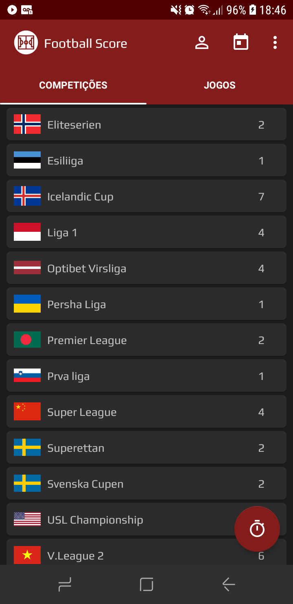
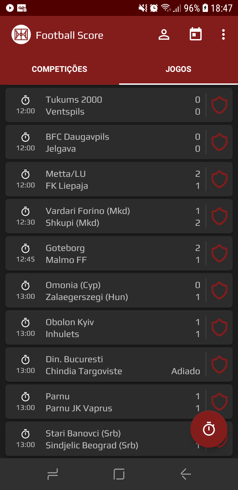
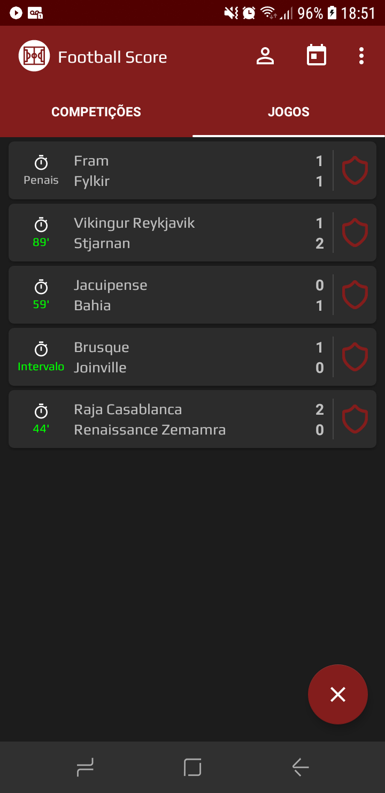
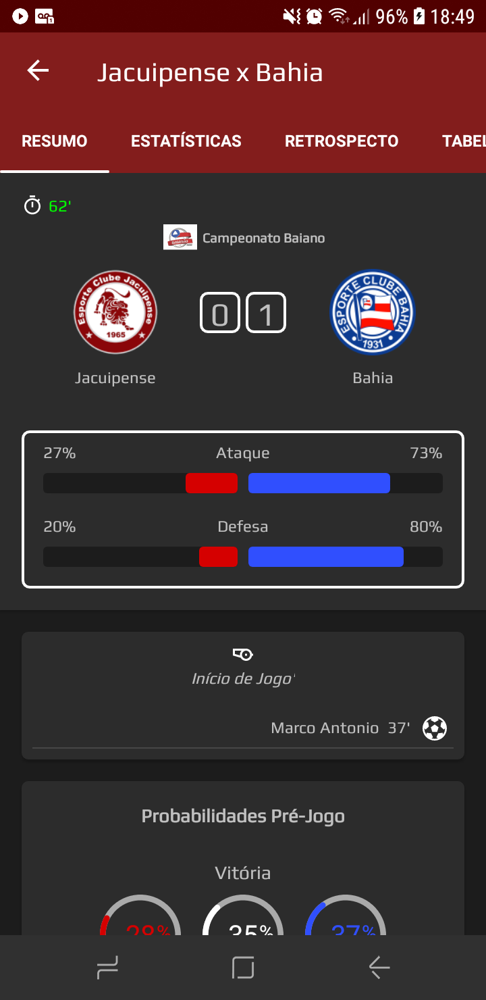
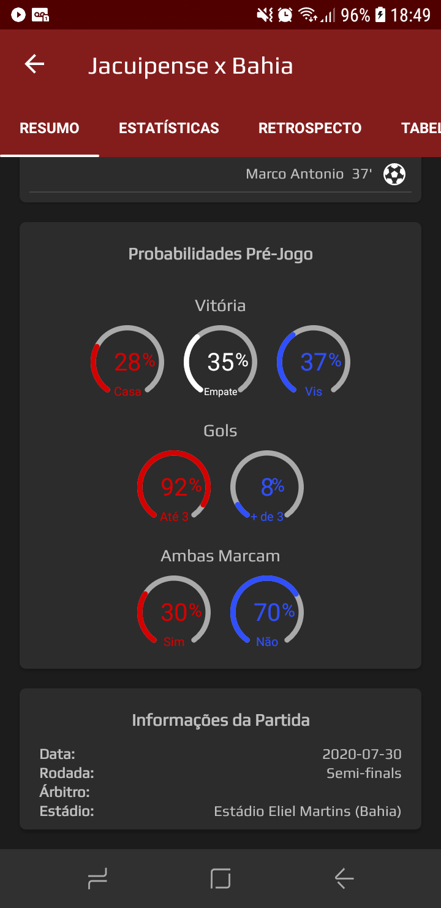
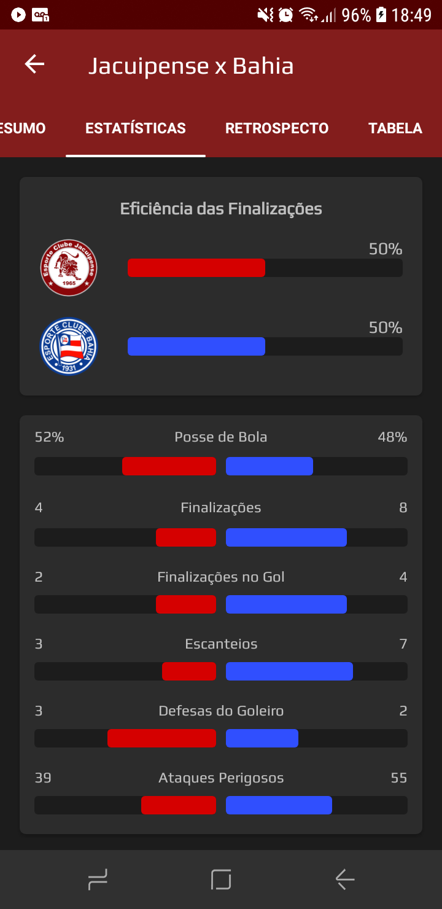
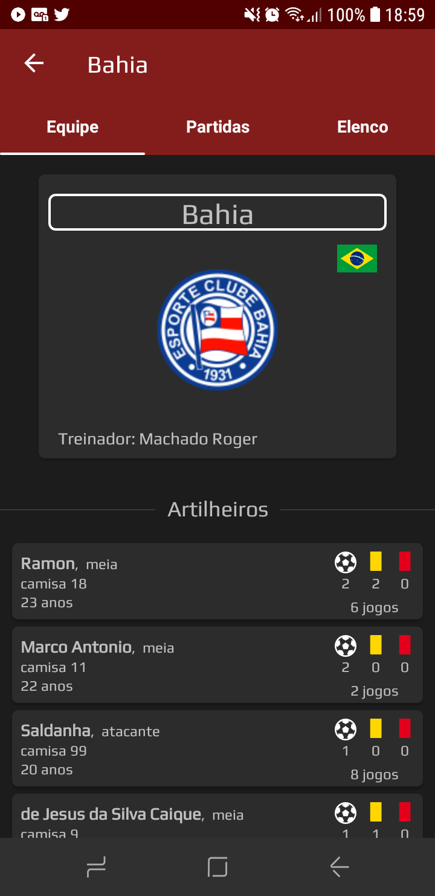
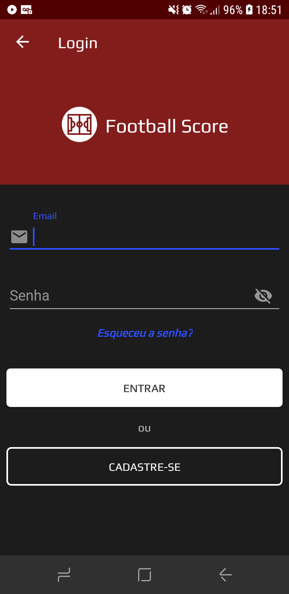

<h1>
Football Score

</h1>

         

Para acessar mais imagens clique [aqui](ScreenShots)

# Sobre o projeto
Resultados e dados de partidas de futebol passadas, futuras ou ao vivo e com opção de salvar seus jogos favoritos. **Dark Theme** :new_moon_with_face:

A função principal do app é pontuar através dos termos de Ataque e Defesa as ações dos times na partida(ou até o determinado momento se estiver ao vivo). Tais termos são feitos agrupando as estatísticas gerais da partida e fazendo a relação entre intensidade e eficiência. 

## Contruído com
* Fragments
* TabLayout(smartTabLayout)
* RecyclerView
* Retrofit para acessar a API usada no projeto
* AsyncTask para ajudar a gerenciar os dados das partidas constantemente
* Firebase para salvar os jogos dos usúarios e gerenciar o sistema de cadastro
* Shared Preferences para salvar o estado do dark theme
* DateTimePicker para navegar entre os dias
* Picasso para carregar as badges dos times
* ProgressBar e Circle ProgessBar, o qual indica a probabilidades pré jogo

## Instale o app

## Funcionalidades
* para fazer Login, se cadastrar ou recuperar a senha, aperte no ícone de "usúario"
* para consutar partidas passdas ou futuras, aperte no ícone do "calendário"
* para acessar o menu configurações, aperte do lado do calendário
* para salvar uma partida, clique no escudo no canto diretio na lista de jogos
* para verificar campeonatos e partidas ao vivo, aperte no botão flutuante no canto inferior-direito
* ao clicar num campeonato(na aba "competições"), será exibido todos o seus. E na aba "jogos" estão todos os jogos da presente data
* na tela de uma partida escolhida se tem acesso a todos os dados daquela partida através das abas "resumo", "estatísticas", "retrospecto" e "tabela"
* ao clicar na bandeira ou nome do clube se tem acesso aos dados da equipe como: elenco, artilheiros, e os últimos e próximos jogos

## Observações 
* Após o período de teste da API(15 dias) utilizada no projeto, o campeonatos disponíveis serão apenas a segunda divisão da inglaterra e frança
* push notifications e configuração de idioma ainda não estão implementados
* o app não está no Google PLay. Encontra-se apenas no meu portifólio

